

# Golfable

**Score smarter. Track every round. Play with your crew.**

A phone-first golf companion for keeping score with friends, running your own tournaments,
and actually learning something from the rounds you play.

[**Open the app →**](https://golfable.nilssonjonathan.com)&nbsp;&nbsp;·&nbsp;&nbsp;
[Report a bug](https://github.com/jnilssonn/golfable/issues/new?template=bug_report.yml)&nbsp;&nbsp;·&nbsp;&nbsp;
[Suggest a feature](https://github.com/jnilssonn/golfable/issues/new?template=feature_request.yml)

 

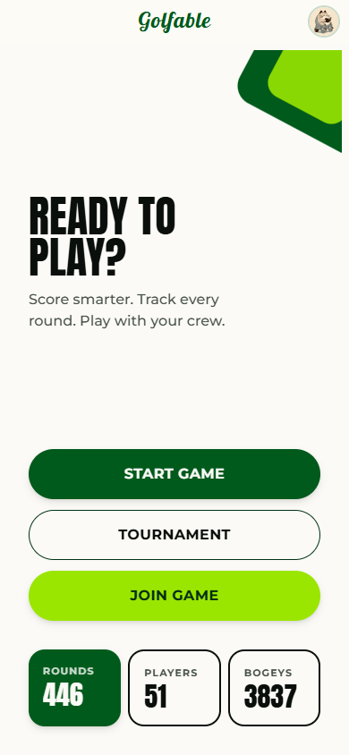&nbsp;&nbsp;
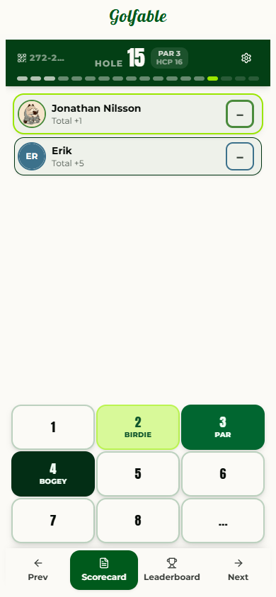&nbsp;&nbsp;
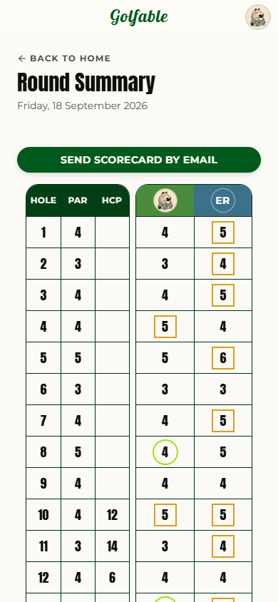

 

## What is Golfable?

Golfable is a web app you open on your phone on the first tee. One person starts a game, everyone
else joins by scanning a QR code, and from there every score is shared live across the group —
no more "what did you get on 7?" on the walk to the next tee.

Behind the scorecard sits everything a group of friends needs to turn casual rounds into a proper
season: multi-day tournaments, rosters and pairings, side games, a live leaderboard, and
per-player stats that go far deeper than the total.

It installs to your home screen like a native app, works on any phone, and is free to use.

 

## Play a round

Pick the number of players, a format and a course — then hit **Let's play**. The course picker
knows every golf club in Sweden, with your favourites pinned to the top. Friends join your game
by scanning the QR code or typing the game code, and guests can play without an account at all.

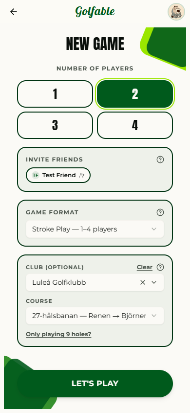&nbsp;&nbsp;
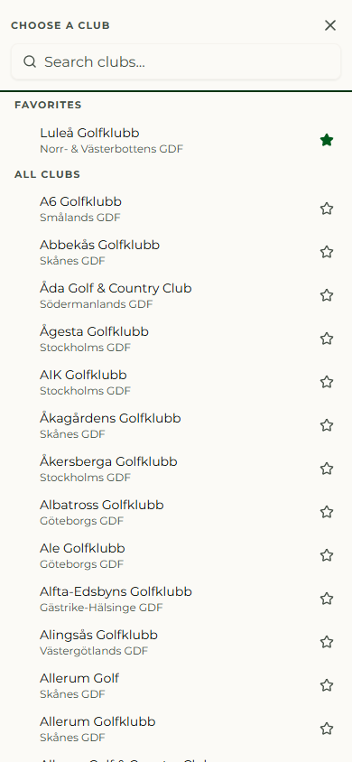&nbsp;&nbsp;
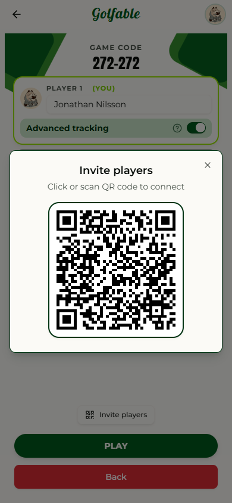

 

The scorecard is built for thumbs: one tap per hole, live totals for everyone in the group, and a
full 18-hole grid one tab away. Scores sync between phones in real time, so whoever is keeping
score, everybody's card is always up to date.

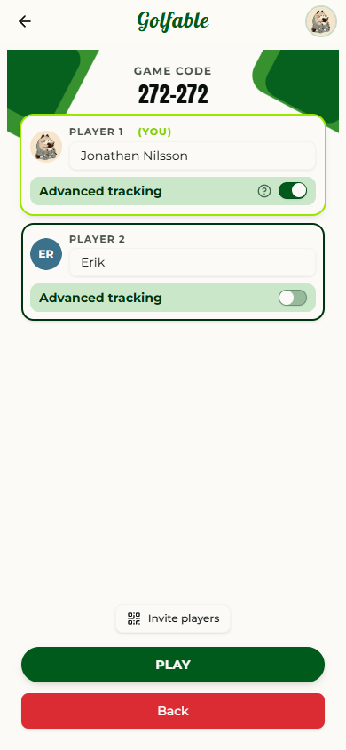&nbsp;&nbsp;
&nbsp;&nbsp;
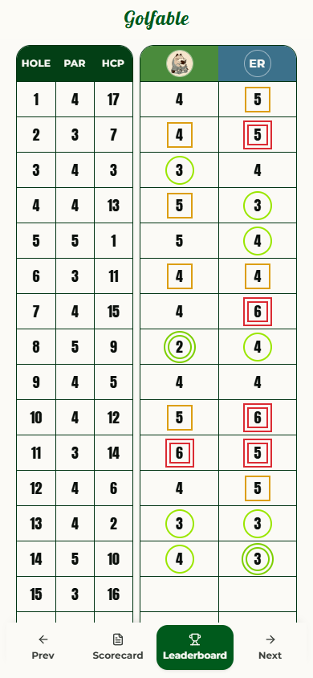

- **Formats** — Stroke play, match play and *Köpenhamnare* for three- and four-balls
- **Any group size** — 1 to 4 players per card, with more players joining mid-round if a slot is open
- **Guest play** — join with a QR scan, no account required; sign in later and the round is still yours
- **Resume anywhere** — an in-progress round is offered back to you if you close the app

 

## Track your game — if you want to

Flip on **Advanced tracking** for any player and Golfable asks three quick questions after each
hole: where the tee shot went and with which club, how the approach played, and how many putts it
took. It's optional per player and per hole, and it never slows down someone who just wants to
keep score.

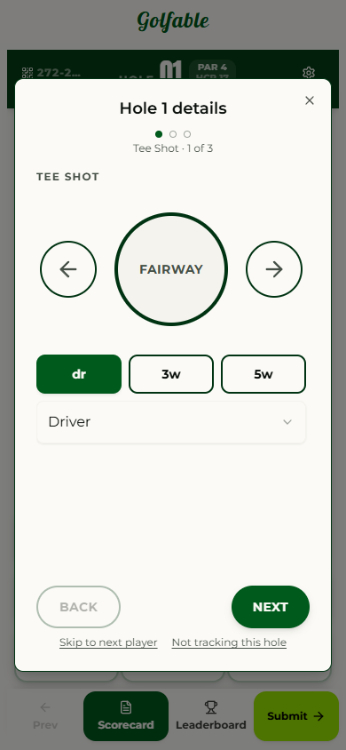&nbsp;&nbsp;
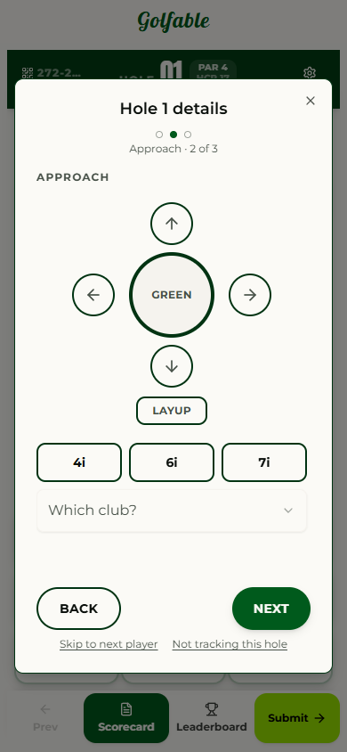&nbsp;&nbsp;
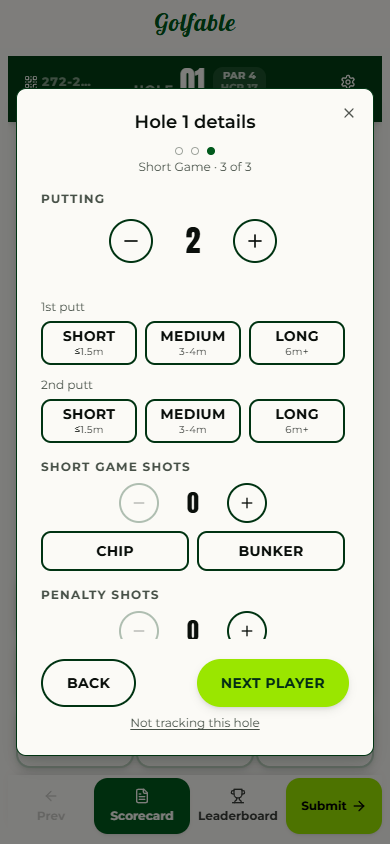

 

## Every round ends with a story

When the last putt drops, Golfable turns the card into a summary: the full grid, a score
breakdown, par-3/4/5 averages, and **The Big 5** — five checks on the mistakes that actually cost
strokes (three-putts, blown up-and-downs, bogeys with a scoring club in hand…). Send the scorecard
to your inbox with one tap.

&nbsp;&nbsp;
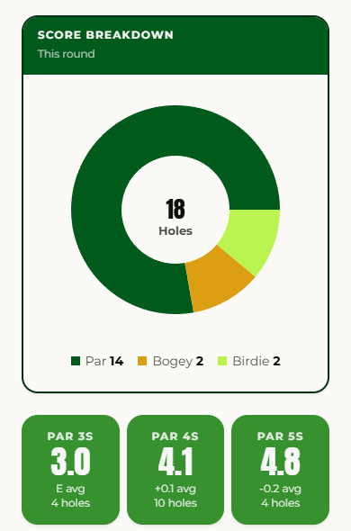&nbsp;&nbsp;
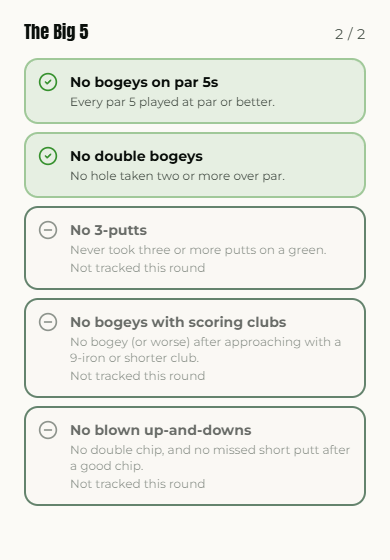

 

## Your profile, your numbers

Every round you play feeds your profile: handicap index, average and best scores, a score-over-time
trend, and a breakdown of how you score across all your holes. With advanced tracking on, the
**Advanced insights** section shows how each club performs off the tee and into the green.

Once you've tracked a few rounds, the **AI Coach** reads your stats and tells you what to spend
your next range session on — and keeps a history so you can see whether it's working.

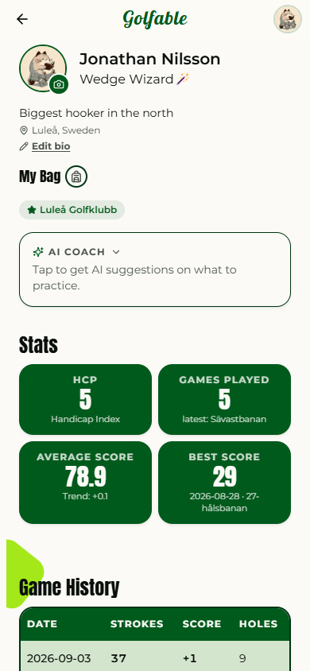&nbsp;&nbsp;
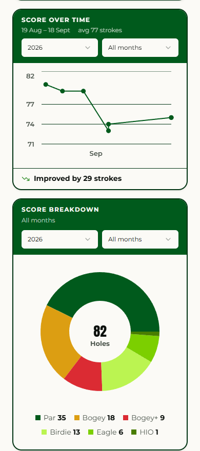&nbsp;&nbsp;
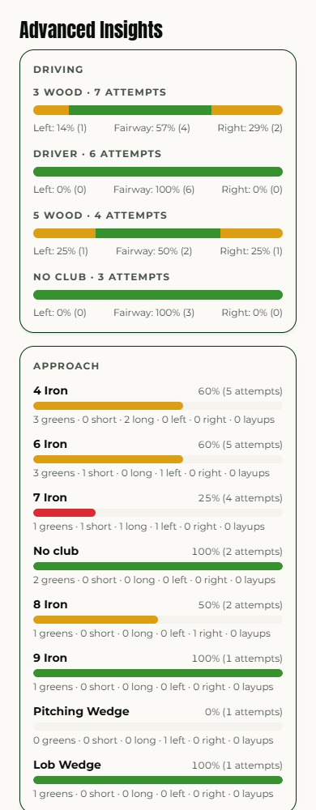

- **My Bag** — set up the clubs you actually carry so tracking only offers those
- **Friends** — add friends, see their profiles, invite them straight into a game
- **Handicap** — an index that updates as you play (highlighted rounds count toward it)

 

## Run a tournament

This is where Golfable stops being a scorecard and becomes a tournament desk in your pocket.
Create a **one-day tournament**, a **multi-day event** (a weekend across several courses), or an
**ongoing series** that collects rounds all summer long.

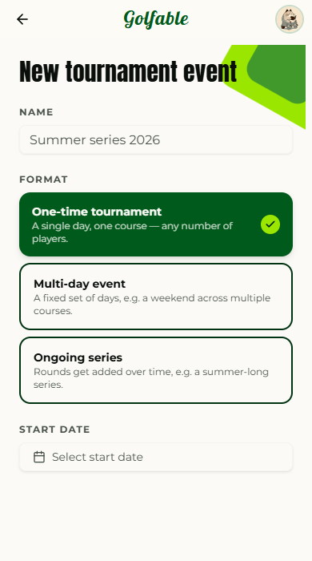&nbsp;&nbsp;
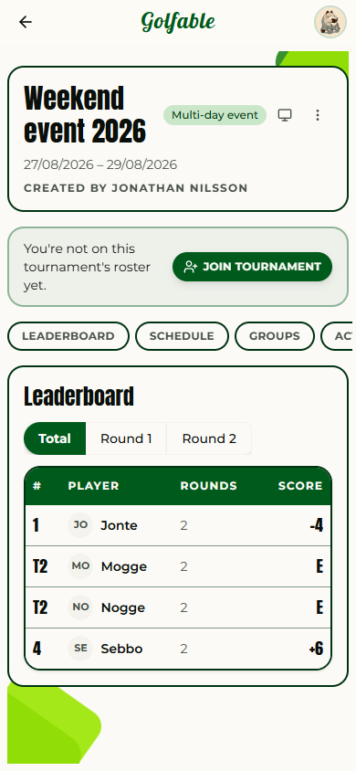&nbsp;&nbsp;
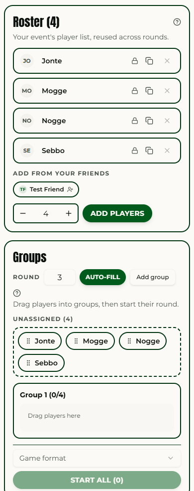

 

Players **apply to join** or get added from your friends list. Drag them into groups, hit
**Start all**, and each group gets its own live scorecard. Standings roll up per round and in
total, with a trend chart showing who's climbing and who's fading. Put the **big board** on a TV
in the clubhouse.

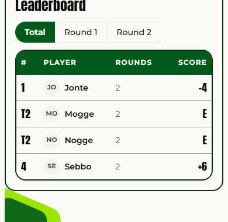&nbsp;&nbsp;
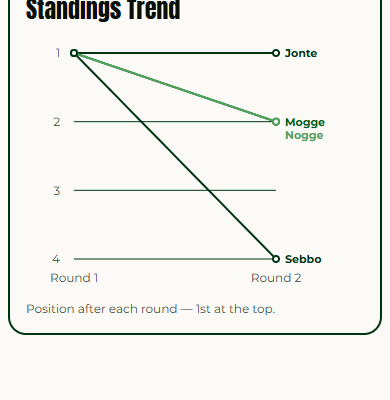&nbsp;&nbsp;
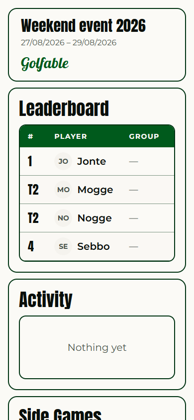

 

**Organiser tools** live on one page:

<table align="center">
<tr>
<td width="230" valign="top">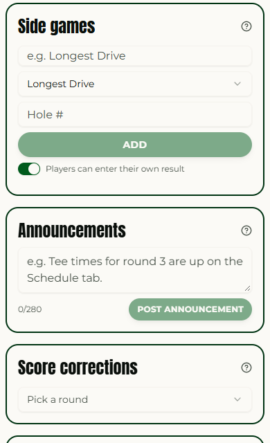</td>
<td valign="top">

- **Schedule** — plan each day's date, club and course
- **Roster & applications** — approve who's in, reuse the list across rounds
- **Groups & pairings** — drag-and-drop, auto-fill, per-group QR codes
- **Side games** — longest drive, closest to the pin, or your own; players enter their result right from the scorecard
- **Announcements** — "tee times for round 3 are up" reaches everyone in the event's activity feed
- **Score corrections** — fix a mis-tapped score after the round without touching anything else
- **Export** — the whole event as CSV or PDF

</td>
</tr>
</table>

 

## Project activity

Golfable is built in the open, but the source code is private. This section is updated
automatically from the development repository on every release.

<!-- activity:start -->
**297 commits** since 2026-02-02 · **165** in the last 30 days · last updated 2026-09-18

**Contributors**

- jnilssonn — 232 commits
- Claude (AI pair programmer) — 81 commits
- Morgan Johansson — 4 commits
- Sebastian Fröberg — 3 commits
- Mojjozz — 2 commits

**Recent changes**

| Date | Change |
|---|---|
| 2026-09-18 | Sync commit activity to the public showcase repo |
| 2026-09-13 | Give the phone a club picker screen instead of a dropdown |
| 2026-09-13 | Open the club list at the top of the screen on a phone |
| 2026-09-13 | Search clubs from inside the popup instead of the field itself |
| 2026-09-12 | Show fewer clubs at once and keep the phone keyboard down |
| 2026-09-07 | Add a group-codes section to the Manage page |
| 2026-09-07 | Drop the all-groups round board; every join link is per-group |
| 2026-09-07 | Land invite links in the player's own group, seat already theirs |
| 2026-09-07 | Stack par over stroke index in the scorecard header badge |
| 2026-09-07 | Let the players breathe under the scorecard header |
<!-- activity:end -->

 

## Feedback

Golfable is used by real groups every week, and most of what's in it started as someone saying
"you know what would be nice…". If that's you:

- 🐛 **Something broke?** [Open a bug report](https://github.com/jnilssonn/golfable/issues/new?template=bug_report.yml)
- 💡 **Have an idea?** [Suggest a feature](https://github.com/jnilssonn/golfable/issues/new?template=feature_request.yml)
- 👀 **Just curious?** Browse the [open issues](https://github.com/jnilssonn/golfable/issues) to see what's being worked on

 

## Under the hood

A React + TypeScript progressive web app talking to a .NET API over REST and SignalR (that's what
keeps every phone's scorecard in sync). Sign-in is handled by Firebase, and the AI Coach runs on
Anthropic's Claude. Hosted at [golfable.nilssonjonathan.com](https://golfable.nilssonjonathan.com).

 

Built in Luleå, Sweden by <a href="https://github.com/jnilssonn">Jonathan Nilsson</a>. Source code is private; this repository is the project's public home.

